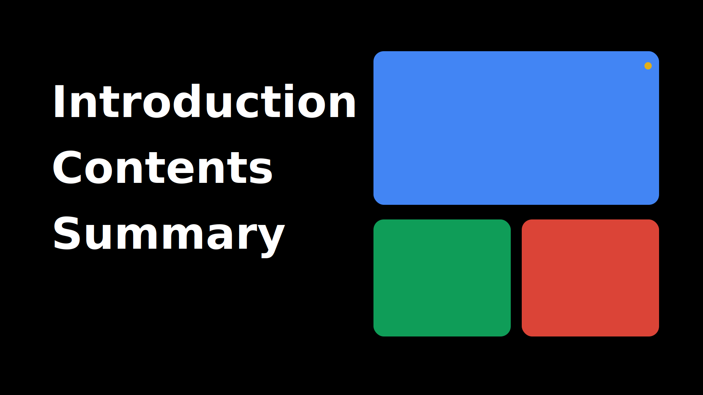

# アジェンダコンポーネント要件定義

## SVGリファレンス

```svg
<svg width="1920" height="1080" viewBox="0 0 1920 1080" xmlns="http://www.w3.org/2000/svg">
  <rect width="1920" height="1080" fill="#000000"/>

  <g font-family="Inter, 'SF Pro Display', system-ui, -apple-system, 'Segoe UI', Roboto, Helvetica, Arial, sans-serif"
     fill="#FFFFFF" font-weight="700" letter-spacing="0.2px">
    <text x="140" y="320" font-size="120">Introduction</text>
    <text x="140" y="500" font-size="120">Contents</text>
    <text x="140" y="680" font-size="120">Summary</text>
  </g>

  <g>
    <rect x="1020" y="140" rx="28" ry="28" width="780" height="420" fill="#4285F4"/>
    <rect x="1020" y="600" rx="28" ry="28" width="375" height="320" fill="#0F9D58"/>
    <rect x="1425" y="600" rx="28" ry="28" width="375" height="320" fill="#DB4437"/>
    <circle cx="1770" cy="180" r="10" fill="#F4B400" opacity="0.9"/>
  </g>
</svg>
```

## 目的
- プレゼン冒頭でアジェンダの3項目を力強く提示し、視線誘導を左→右→上段→下段の順で自然に行わせる。
- 左側にAppleライクなタイポグラフィ、右側にGoogleカラーパレットを活かしたビジュアル面を配置することで、洗練と遊び心のバランスを取る。

## レイアウト
- アートボードサイズ: 1920 × 1080 (16:9)。
- 背景: `#000000`。全面に均一なブラックを敷き、他の装飾は置かない。
- 左カラム: 左端から 140px を起点に、各テキストを垂直方向に 180px 間隔で配置。
  - 1行あたりの高さ目安 120px、行間は 180px のリズムを維持。
  - 左カラムは安全余白 120px 以内に収め、テキスト幅は視覚的に 720px 以内を推奨。
- 右カラム: x=1020px を起点にギャラリーカードを配置。
  - 上段: 780×420px のカード1枚。
  - 下段: 375×320px のカードを左右に配置し、カラム間隔は 30px。
  - 角丸はすべて `rx=28` の統一値。
- アクセントドットは右上 (x=1770, y=180) に 20px の直径で配置。必要に応じて省略可能。

## タイポグラフィ
- フォントファミリー: `Inter` を第一候補、なければ `'SF Pro Display'`, `system-ui`, `-apple-system`, `'Segoe UI'`, `Roboto`, `Helvetica`, `Arial`, `sans-serif`。
- ウェイト: 700 (Bold)。
- フォントサイズ: 120pt 固定。
- 文字色: `#FFFFFF`。
- 字間 (letter-spacing): 0.2px を保持し、トラッキングをやや広めに取って呼吸感を演出。

## カラーパレット
- 背景: `#000000`。
- カード (Googleカラー):
  - ブルー: `#4285F4`
  - グリーン: `#0F9D58`
  - レッド: `#DB4437`
  - アクセントイエロー: `#F4B400` (小さなドットで使用)
- テキスト: `#FFFFFF`。
- これらの色はブランド整合性のため必ず HEX 値で指定する。

## アクセシビリティ & 可読性
- ブラック背景に白文字でコントラストを確保 (WCAG AAAクリア)。
- フォントサイズ120ptは大型スクリーンでの視認性◎。
- 右側カードは単色塗りつぶしのため、必要に応じてカード内要素を追加する場合は最低 4.5:1 のコントラスト比を確保する。
- 角丸カードの半径統一は視覚的な連続性と視認性を向上させる。

## 実装メモ
- SVGをそのまま Assets として使用でき、FigmaやGoogle Slidesでの再現時は以下を守る:
  - 左カラムテキストはテキストオブジェクトを用いて可変に保つ。
  - 右カラムカードは矩形コンポーネント化し、背景色をブランドカラーとして指定。
  - アクセントドットはオプション扱い。要件に応じて非表示でも可。
- 安全余白ガイドを表示したい場合は `<rect>` のコメントアウトを解除し、`stroke` に `#ffffff22` を設定。
- レイアウトをレスポンシブにする場合は、左右のカラムをスタックさせるブレイクポイントを 992px 付近に設定し、縦レイアウトではテキストを上、カードを下に配置する。

