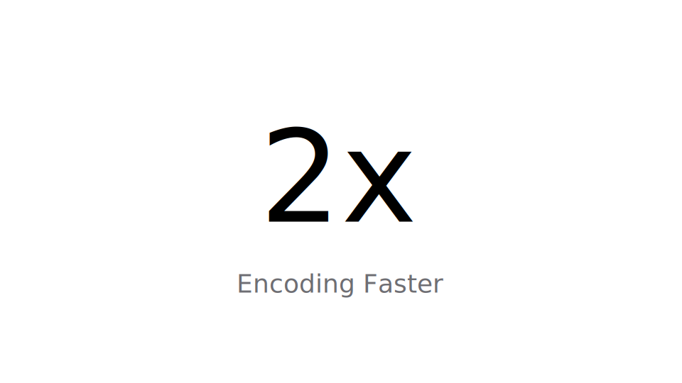

# ビクファクトスライド要件定義

## 目的
- エンコード性能向上をシンプルに訴求する「2x」メッセージを端的に伝える。
- Appleデザインライクな余白とタイポグラフィで、落ち着きと信頼感を演出する。

## レイアウト
- アートボードサイズ: 960 × 540 (16:9)。
- 背景: `#FFFFFF` 単色、余計な装飾は不可。
- メイン数値 "2x" はキャンバス中央に水平垂直中央揃え。
- サブコピー "Encoding Faster" はメイン数値の真下、垂直距離 100px を目安に配置。
- 余白はキャンバス左右で十分にとり、他要素は配置しない。

## タイポグラフィ
- メイン数値: フォント `inter` (代替: `Helvetica Neue`, `Arial`, sans-serif)。
  - ウェイト: Medium (500)。
  - サイズ: 180pt。
  - 文字色: `#000000`。
- サブコピー: 同フォントファミリー。
  - ウェイト: Regular (400)。
  - サイズ: 36pt。
  - 文字色: `#6E6E73` (Apple System Gray 4 相当)。
  - 字間はデフォルト、文字間調整は行わない。

## アクセシビリティ
- コントラスト比: 背景白に対しメイン数値・サブコピーが十分な視認性を確保。
- テキストは選択可能に保ち、画像化しない。

## 実装メモ
- SVGでの再現例は `Playground.svg` を参照。
- フォントが環境に存在しない場合は代替フォントでの表示を許容する。
- 画面サイズが異なるプラットフォームでは中心揃えレイアウトを維持するレスポンシブ調整を行う。
